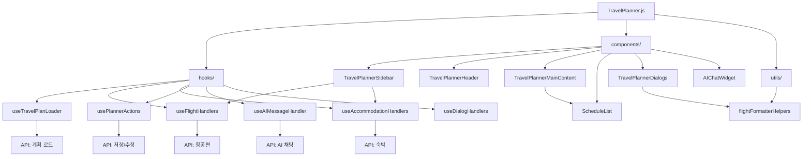

# TravelPlanner 모듈 가이드

TravelPlanner는 여행 계획을 생성, 편집, 관리할 수 있는 종합적인 여행 플래너 애플리케이션입니다. 이 디렉토리는 모듈화된 구조로 설계되어 유지보수성과 확장성을 극대화했습니다.

## 📁 전체 디렉토리 구조

```
TravelPlanner/
├── TravelPlanner.js              # 메인 컴포넌트 (833줄)
├── index.js                      # 엔트리 포인트
├── hooks/                        # 커스텀 훅들
│   ├── useDialogHandlers.js      # 다이얼로그 상태 관리 (138줄)
│   ├── useTravelPlanLoader.js    # 계획 로드 및 초기화 (884줄)
│   ├── useFlightHandlers.js      # 항공편 검색 및 관리 (511줄)
│   ├── useAIMessageHandler.js    # AI 채팅 처리 (167줄)
│   ├── usePlannerActions.js      # 플래너 액션 관리 (491줄)
│   ├── useAccommodationHandlers.js # 숙박 검색 및 관리 (174줄)
│   └── README.md                 # 훅 가이드
├── components/                   # UI 컴포넌트들
│   ├── TravelPlannerSidebar.js   # 사이드바 (243줄)
│   ├── TravelPlannerHeader.js    # 헤더 (127줄)
│   ├── TravelPlannerMainContent.js # 메인 컨텐츠 (194줄)
│   ├── ScheduleList.js           # 일정 목록 (183줄)
│   ├── TravelPlannerDialogs.js   # 다이얼로그 모음 (357줄)
│   ├── AIChatWidget.js           # AI 채팅 위젯 (278줄)
│   └── README.md                 # 컴포넌트 가이드
├── utils/                        # 유틸리티 함수들
│   ├── flightFormatterHelpers.js # 항공편 포맷팅 (41줄)
│   └── README.md                 # 유틸리티 가이드
└── README.md                     # 이 파일
```

## 🎯 모듈화 개요

### 📊 **모듈화 성과**
- **기존**: 1615줄의 단일 파일
- **현재**: 833줄 메인 + 6개 훅 + 6개 컴포넌트 + 1개 유틸리티
- **코드 감소**: 약 **48%** (메인 파일 기준)
- **총 파일 수**: 15개 파일로 분산

### 🏗️ **아키텍처 원칙**
1. **단일 책임 원칙**: 각 모듈이 하나의 명확한 역할
2. **관심사 분리**: UI, 로직, 데이터 처리 분리
3. **재사용성**: 독립적으로 사용 가능한 컴포넌트
4. **확장성**: 새로운 기능 추가 용이

## 🔧 각 디렉토리의 역할

### 📂 `/hooks` - 비즈니스 로직 계층
**역할**: 상태 관리와 비즈니스 로직을 담당하는 커스텀 훅들

**주요 특징**:
- React 훅 패턴 활용
- 상태와 로직의 재사용성
- API 호출 및 데이터 처리
- 컴포넌트 간 상태 공유

**핵심 훅들**:
- `useTravelPlanLoader`: 계획 데이터 로드 및 초기화
- `useFlightHandlers`: 항공편 검색 및 관리
- `useAccommodationHandlers`: 숙박 검색 및 관리
- `usePlannerActions`: 플래너 핵심 액션들
- `useAIMessageHandler`: AI 채팅 처리
- `useDialogHandlers`: 다이얼로그 상태 통합 관리

### 📂 `/components` - 프레젠테이션 계층
**역할**: 사용자 인터페이스를 구성하는 React 컴포넌트들

**주요 특징**:
- 재사용 가능한 UI 컴포넌트
- Props 기반 데이터 전달
- 반응형 디자인 지원
- Material-UI 테마 일관성

**핵심 컴포넌트들**:
- `TravelPlannerSidebar`: 좌측 네비게이션 및 검색
- `TravelPlannerHeader`: 상단 헤더 및 제목 관리
- `TravelPlannerMainContent`: 메인 컨텐츠 영역
- `ScheduleList`: 드래그 앤 드롭 일정 목록
- `TravelPlannerDialogs`: 모든 다이얼로그 통합
- `AIChatWidget`: AI 채팅 인터페이스

### 📂 `/utils` - 유틸리티 계층
**역할**: 재사용 가능한 헬퍼 함수들과 데이터 변환 로직

**주요 특징**:
- 순수 함수들로 구성
- 도메인별 포맷팅 로직
- 에러 처리 및 검증
- 테스트 용이성

**핵심 유틸리티들**:
- `flightFormatterHelpers`: 항공편 데이터 포맷팅

## 🔄 모듈 간 상호작용



## 💡 사용 패턴

### 1. 메인 컴포넌트 구조
```javascript
const TravelPlanner = ({ loadMode }) => {
  // 1. 데이터 로드 및 초기화
  const planData = useTravelPlanLoader(user, planIdFromUrl, loadMode);
  
  // 2. 기능별 핸들러들
  const flightHandlers = useFlightHandlers();
  const accommodationHandlers = useAccommodationHandlers();
  const plannerActions = usePlannerActions(planData);
  const dialogHandlers = useDialogHandlers();
  
  // 3. AI 통합
  const handleAISendMessage = useAIMessageHandler(planData, setters);
  
  // 4. UI 렌더링
  return (
    <LocalizationProvider dateAdapter={AdapterDateFns}>
      <Box sx={{ display: 'flex', height: '100vh' }}>
        <TravelPlannerSidebar {...sidebarProps} />
        <Box sx={{ flex: 1, display: 'flex', flexDirection: 'column' }}>
          <TravelPlannerHeader {...headerProps} />
          <TravelPlannerMainContent {...mainContentProps} />
        </Box>
        <TravelPlannerDialogs {...dialogProps} />
        <AIChatWidget onSendMessage={handleAISendMessage} />
      </Box>
    </LocalizationProvider>
  );
};
```

### 2. 데이터 흐름
```javascript
// 훅에서 컴포넌트로 데이터 전달
const flightHandlers = useFlightHandlers();
const accommodationHandlers = useAccommodationHandlers();

// 스프레드 연산자로 props 전달
<TravelPlannerSidebar
  {...flightHandlers}
  {...accommodationHandlers}
  {...plannerActions}
/>
```

### 3. 이벤트 처리
```javascript
// 다이얼로그 핸들러 통합
const dialogHandlers = useDialogHandlers();

// 컴포넌트에서 핸들러 사용
<TravelPlannerMainContent
  handleOpenShareDialog={dialogHandlers.handleOpenShareDialog}
  setIsSearchOpen={dialogHandlers.setIsSearchOpen}
/>
```

## 🚀 확장 가이드

### 새로운 기능 추가 시:

#### 1. 새로운 도메인 영역 추가
```bash
# 1. 새로운 훅 생성
hooks/useNewFeatureHandlers.js

# 2. 관련 컴포넌트 생성
components/NewFeatureComponent.js

# 3. 유틸리티 함수 추가 (필요시)
utils/newFeatureHelpers.js

# 4. 메인 컴포넌트에 통합
TravelPlanner.js
```

#### 2. 기존 기능 확장
```javascript
// 기존 훅에 새로운 상태/핸들러 추가
const useFlightHandlers = () => {
  // 기존 로직...
  
  // 새로운 기능 추가
  const [newFeatureState, setNewFeatureState] = useState(null);
  const handleNewFeature = useCallback(() => {
    // 새로운 기능 로직
  }, []);
  
  return {
    // 기존 반환값...
    newFeatureState,
    handleNewFeature
  };
};
```

#### 3. 새로운 다이얼로그 추가
```javascript
// 1. useDialogHandlers.js에 상태 추가
const [isNewDialogOpen, setIsNewDialogOpen] = useState(false);

// 2. TravelPlannerDialogs.js에 다이얼로그 추가
{isNewDialogOpen && (
  <Dialog open={isNewDialogOpen} onClose={handleCloseNewDialog}>
    {/* 다이얼로그 내용 */}
  </Dialog>
)}

// 3. 메인 컴포넌트에서 사용
<TravelPlannerDialogs
  isNewDialogOpen={dialogHandlers.isNewDialogOpen}
  // ...
/>
```

## 🧪 테스트 전략

### 1. 단위 테스트
```bash
# 훅 테스트
hooks/__tests__/useFlightHandlers.test.js

# 컴포넌트 테스트
components/__tests__/TravelPlannerSidebar.test.js

# 유틸리티 테스트
utils/__tests__/flightFormatterHelpers.test.js
```

### 2. 통합 테스트
```bash
# 메인 컴포넌트 통합 테스트
__tests__/TravelPlanner.integration.test.js
```

### 3. E2E 테스트
```bash
# 전체 플로우 테스트
e2e/travelPlanner.e2e.test.js
```

## 📈 성능 최적화

### 1. 메모이제이션
```javascript
// 컴포넌트 메모이제이션
export default React.memo(TravelPlannerSidebar);

// 훅에서 useCallback/useMemo 활용
const handleFlightSearch = useCallback(() => {
  // 검색 로직
}, [dependencies]);
```

### 2. 코드 스플리팅
```javascript
// 동적 임포트로 번들 크기 최적화
const AIChatWidget = React.lazy(() => import('./components/AIChatWidget'));
```

### 3. 상태 최적화
```javascript
// 불필요한 리렌더링 방지
const memoizedValue = useMemo(() => {
  return expensiveCalculation(data);
}, [data]);
```

## 📝 개발 가이드라인

### 1. 코딩 컨벤션
- **파일명**: PascalCase (컴포넌트), camelCase (훅, 유틸리티)
- **함수명**: camelCase, 동사 + 명사 형태
- **상수명**: UPPER_SNAKE_CASE
- **Props**: 명확한 타입과 기본값 정의

### 2. 문서화
- 각 디렉토리에 README.md 필수
- 복잡한 로직은 JSDoc 주석 추가
- Props 인터페이스 명시
- 사용 예시 코드 포함

### 3. 에러 처리
- 모든 API 호출에 에러 처리
- 사용자 친화적 에러 메시지
- 로딩 상태 표시
- 폴백 UI 제공

## 🔍 디버깅 가이드

### 1. 개발 도구 활용
```javascript
// React DevTools로 컴포넌트 트리 확인
// Redux DevTools로 상태 변화 추적 (필요시)
```

### 2. 로깅 전략
```javascript
// 개발 환경에서만 로깅
if (process.env.NODE_ENV === 'development') {
  console.log('Debug info:', data);
}
```

### 3. 에러 바운더리
```javascript
// 컴포넌트 에러 캐치
<ErrorBoundary>
  <TravelPlanner />
</ErrorBoundary>
```

## 📚 참고 자료

- [React Hooks 공식 문서](https://reactjs.org/docs/hooks-intro.html)
- [Material-UI 컴포넌트](https://mui.com/components/)
- [React Beautiful DnD](https://github.com/atlassian/react-beautiful-dnd)
- [Date-fns 라이브러리](https://date-fns.org/)

## 🤝 기여 가이드

1. **이슈 생성**: 새로운 기능이나 버그 리포트
2. **브랜치 생성**: `feature/새기능명` 또는 `fix/버그명`
3. **코드 작성**: 가이드라인 준수
4. **테스트 추가**: 새로운 기능에 대한 테스트
5. **문서 업데이트**: README 및 주석 업데이트
6. **PR 생성**: 상세한 설명과 함께

---

이 가이드는 TravelPlanner 모듈의 전체적인 구조와 사용법을 설명합니다. 각 하위 디렉토리의 상세한 내용은 해당 디렉토리의 README.md를 참조하세요. 