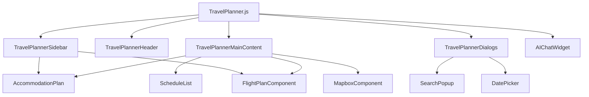

# TravelPlanner Components 가이드

이 디렉토리는 TravelPlanner의 UI를 구성하는 React 컴포넌트들을 포함합니다. 각 컴포넌트는 특정 UI 영역을 담당하며, 재사용 가능하고 독립적으로 설계되었습니다.

## 📁 파일 구조

```
components/
├── TravelPlannerSidebar.js      # 사이드바 (탭 네비게이션)
├── TravelPlannerHeader.js       # 헤더 (제목 편집, 메뉴 토글)
├── TravelPlannerMainContent.js  # 메인 컨텐츠 영역
├── ScheduleList.js              # 일정 목록 (드래그 앤 드롭)
├── TravelPlannerDialogs.js      # 모든 다이얼로그 모음
├── AIChatWidget.js              # AI 채팅 위젯
└── README.md                    # 이 파일
```

## 🎨 각 컴포넌트의 역할

### 1. `TravelPlannerSidebar.js` (243줄)
**역할**: 좌측 사이드바 전체 UI

**주요 기능**:
- 탭 네비게이션 (여행 계획, 숙소 계획, 비행 계획)
- 날짜별 일정 목록 및 드래그 앤 드롭
- 저장/수정 버튼
- 숙소/항공편 검색 인터페이스

**Props**:
```javascript
{
  // UI 상태
  isSidebarOpen, sidebarTab, setSidebarTab,
  
  // 계획 데이터
  dayOrder, travelPlans, selectedDay, setSelectedDay,
  
  // 액션 핸들러
  getDayTitle, plannerAddDay, plannerRemoveDay,
  handleOpenDateEditDialog, handleDayDragEnd,
  handleSaveOrUpdate,
  
  // 숙소 관련
  accommodationFormData, setAccommodationFormData,
  handleSidebarPlaceSelect, handleHotelSearchResults,
  
  // 항공편 관련
  flightSearchParams, originCities, destinationCities,
  handleCitySearch, handleFlightSearch
}
```

**사용 예시**:
```javascript
<TravelPlannerSidebar
  isSidebarOpen={isSidebarOpen}
  sidebarTab={sidebarTab}
  setSidebarTab={setSidebarTab}
  {...plannerActions}
  {...flightHandlers}
  {...accommodationHandlers}
/>
```

### 2. `TravelPlannerHeader.js` (127줄)
**역할**: 상단 헤더 UI

**주요 기능**:
- 사이드바 토글 버튼
- 계획 제목 표시 및 편집
- 탭별 제목 변경

**Props**:
```javascript
{
  toggleSidebar,
  sidebarTab,
  isEditingPlanTitle, setIsEditingPlanTitle,
  tempPlanTitle, setTempPlanTitle,
  planTitle, setPlanTitle, setPlanName,
  planId,
  plannerHandleUpdatePlanTitle
}
```

**특징**:
- 인라인 제목 편집 (클릭하여 편집 모드)
- Enter/Escape 키 지원
- 저장된 계획의 경우 서버 업데이트

### 3. `TravelPlannerMainContent.js` (194줄)
**역할**: 메인 컨텐츠 영역 전체

**주요 기능**:
- 탭별 컨텐츠 렌더링 (일정/숙소/항공편)
- 일정 탭: 일정 목록 + 지도
- 숙소/항공편 탭: 각각의 메인 인터페이스

**Props**:
```javascript
{
  sidebarTab, currentPlan,
  editTitleMode, setEditTitleMode,
  tempTitle, setTempTitle,
  showAllMarkers, setShowAllMarkers,
  showMap, setShowMap,
  handleOpenShareDialog, setIsSearchOpen,
  accommodationToShow, findSameDayAccommodations,
  handleOpenAccommodationDetail,
  renderScheduleItem, // 일정 항목 렌더링 함수
  // ... 기타 props
}
```

**레이아웃**:
- 일정 탭: Grid 레이아웃 (일정 목록 | 지도)
- 숙소/항공편 탭: 전체 화면 사용

### 4. `ScheduleList.js` (183줄)
**역할**: 일정 목록 표시 및 관리

**주요 기능**:
- 고정된 숙박/항공편 정보 박스
- 드래그 앤 드롭 가능한 일반 일정 목록
- 일정 항목 클릭 시 상세 정보 표시

**Props**:
```javascript
{
  accommodationToShow,
  findSameDayAccommodations,
  handleOpenAccommodationDetail,
  startDate, selectedDay, currentPlan,
  handleScheduleDragEnd,
  renderScheduleItem,
  handleOpenPlannerFlightDetail
}
```

**특징**:
- 숙박 정보: 주황색 배경 (#fff0e6)
- 항공편 정보: 파란색 배경 (#e3f2fd)
- 일반 일정: 드래그 앤 드롭 지원

### 5. `TravelPlannerDialogs.js` (357줄)
**역할**: 모든 다이얼로그 컴포넌트 통합

**포함된 다이얼로그**:
- 장소 검색 다이얼로그
- 일정 수정 다이얼로그
- 날짜 수정 다이얼로그
- 계획 저장 다이얼로그
- 항공편 상세 정보 다이얼로그
- 숙박 상세 정보 다이얼로그
- 계획 공유 다이얼로그

**Props**:
```javascript
{
  // 각 다이얼로그별 상태와 핸들러
  isSearchOpen, setIsSearchOpen, onAddPlace,
  editDialogOpen, setEditDialogOpen, editSchedule,
  isDateEditDialogOpen, tempStartDate,
  isSaveDialogOpen, planTitleForSave,
  isPlannerFlightDetailOpen, selectedFlightForPlannerDialog,
  isAccommodationDetailOpen, selectedAccommodationForDialog,
  isShareDialogOpen, sharedEmail, shareMessage
}
```

**특징**:
- 모든 다이얼로그를 하나의 컴포넌트에서 관리
- 조건부 렌더링으로 필요한 다이얼로그만 표시
- 일관된 스타일과 동작

### 6. `AIChatWidget.js` (278줄)
**역할**: AI 채팅 인터페이스

**주요 기능**:
- 플로팅 채팅 위젯
- 메시지 입력 및 전송
- AI 응답 표시
- 채팅 히스토리 관리

**Props**:
```javascript
{
  onSendMessage  // AI 메시지 전송 핸들러
}
```

**특징**:
- 우하단 고정 위치
- 접기/펼치기 기능
- 실시간 메시지 스트리밍

## 🔄 컴포넌트 간의 관계



## 💡 사용 패턴

### 1. 메인 컴포넌트에서의 조합
```javascript
const TravelPlanner = () => {
  return (
    <Box sx={{ display: 'flex', height: '100vh' }}>
      <TravelPlannerSidebar {...sidebarProps} />
      
      <Box sx={{ flex: 1, display: 'flex', flexDirection: 'column' }}>
        <TravelPlannerHeader {...headerProps} />
        <TravelPlannerMainContent {...mainContentProps} />
      </Box>
      
      <TravelPlannerDialogs {...dialogProps} />
      <AIChatWidget onSendMessage={handleAISendMessage} />
    </Box>
  );
};
```

### 2. Props 전달 패턴
```javascript
// 훅에서 반환된 값들을 스프레드로 전달
<TravelPlannerSidebar
  {...plannerActions}
  {...flightHandlers}
  {...accommodationHandlers}
  {...dialogHandlers}
/>
```

### 3. 조건부 렌더링
```javascript
// TravelPlannerMainContent 내부
{sidebarTab === 'schedule' && (
  <ScheduleList {...scheduleListProps} />
)}
{sidebarTab === 'accommodation' && (
  <AccommodationPlan {...accommodationProps} />
)}
```

## 🎨 스타일링 가이드

### 1. Material-UI 테마 사용
```javascript
// 일관된 색상과 간격 사용
sx={{
  bgcolor: 'background.paper',
  borderColor: 'divider',
  color: 'text.primary'
}}
```

### 2. 반응형 디자인
```javascript
// Grid 시스템 활용
gridTemplateColumns: showMap ? 
  { xs: '1fr', md: '1fr 1fr' } : '1fr'
```

### 3. 상태별 스타일
```javascript
// 선택된 항목 강조
bgcolor: selectedDay === parseInt(dayKey) ? 
  'primary.light' : 'background.paper'
```

## 🚀 확장 가이드

### 새로운 컴포넌트 추가 시:

1. **단일 책임 원칙**: 하나의 UI 영역만 담당
2. **Props 인터페이스**: 명확한 Props 타입 정의
3. **재사용성**: 다른 곳에서도 사용 가능하도록 설계
4. **접근성**: ARIA 속성 및 키보드 네비게이션 지원

### 예시: 새로운 다이얼로그 추가
```javascript
// 1. TravelPlannerDialogs.js에 추가
{isNewDialogOpen && (
  <Dialog open={isNewDialogOpen} onClose={handleCloseNewDialog}>
    {/* 다이얼로그 내용 */}
  </Dialog>
)}

// 2. useDialogHandlers.js에 상태 추가
const [isNewDialogOpen, setIsNewDialogOpen] = useState(false);

// 3. 메인 컴포넌트에서 사용
<TravelPlannerDialogs
  isNewDialogOpen={dialogHandlers.isNewDialogOpen}
  handleCloseNewDialog={dialogHandlers.handleCloseNewDialog}
  // ...
/>
```

## 📝 주의사항

- **성능**: 불필요한 리렌더링 방지를 위해 React.memo 사용 고려
- **메모리**: 큰 데이터나 복잡한 계산은 useMemo/useCallback 활용
- **에러 처리**: Error Boundary 패턴 적용
- **테스트**: 각 컴포넌트별 단위 테스트 작성
- **문서화**: Props와 사용법을 명확히 문서화
</rewritten_file> 