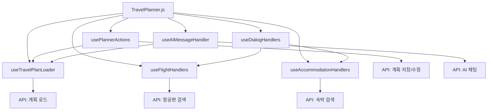

# TravelPlanner Hooks 가이드

이 디렉토리는 TravelPlanner 컴포넌트에서 사용되는 커스텀 React 훅들을 포함합니다. 각 훅은 특정 기능 영역의 상태 관리와 비즈니스 로직을 담당합니다.

## 📁 파일 구조

```
hooks/
├── useDialogHandlers.js      # 다이얼로그 상태 관리
├── useTravelPlanLoader.js    # 여행 계획 로드 및 초기화
├── useFlightHandlers.js      # 항공편 검색 및 관리
├── useAIMessageHandler.js    # AI 채팅 메시지 처리
├── usePlannerActions.js      # 플래너 액션 및 저장 관리
├── useAccommodationHandlers.js # 숙박 검색 및 관리
└── README.md                 # 이 파일
```

## 🔧 각 훅의 역할

### 1. `useDialogHandlers.js` (138줄)
**역할**: 모든 다이얼로그의 상태와 핸들러를 통합 관리

**주요 기능**:
- 검색, 날짜 수정, 저장, 공유 등 다이얼로그 상태 관리
- 항공편/숙박 상세 정보 다이얼로그 제어
- 다이얼로그 열기/닫기 핸들러 제공

**반환값**:
```javascript
{
  // 상태들
  isSearchOpen, setIsSearchOpen,
  isDateEditDialogOpen, tempStartDate,
  selectedFlightForPlannerDialog,
  selectedAccommodationForDialog,
  isShareDialogOpen, sharedEmail, shareMessage,
  
  // 핸들러들
  handleOpenDateEditDialog,
  handleOpenPlannerFlightDetail,
  handleOpenAccommodationDetail,
  handleOpenShareDialog,
  handleSharePlan
}
```

### 2. `useTravelPlanLoader.js` (884줄)
**역할**: 여행 계획 데이터 로드 및 초기화

**주요 기능**:
- URL 파라미터 기반 계획 로드
- 새 계획 vs 기존 계획 로드 분기 처리
- 항공편/숙박 정보 통합 로드
- 계획 상태 초기화 및 동기화

**반환값**:
```javascript
{
  travelPlans, setTravelPlans,
  dayOrder, setDayOrder,
  selectedDay, setSelectedDay,
  startDate, setStartDate,
  planId, setPlanId,
  planName, setPlanName,
  isLoadingPlan,
  loadedFlightInfo,
  loadedFlightInfos,
  isRoundTrip,
  loadError,
  loadedAccommodationInfos
}
```

### 3. `useFlightHandlers.js` (511줄)
**역할**: 항공편 검색, 선택, 일정 추가 관리

**주요 기능**:
- 도시/공항 검색 API 연동
- 항공편 검색 및 결과 관리
- 항공편을 여행 일정에 추가
- 공항 정보 캐싱 및 관리

**반환값**:
```javascript
{
  flightSearchParams, setFlightSearchParams,
  originCities, destinationCities,
  isLoadingCities, isLoadingFlights,
  flightResults, flightDictionaries, flightError,
  handleCitySearch, handleFlightSearch,
  airportInfoCache, loadingAirportInfo,
  handleAddFlightToSchedule,
  updateFlightScheduleDetails
}
```

### 4. `useAIMessageHandler.js` (167줄)
**역할**: AI 채팅 메시지 처리 및 계획 업데이트

**주요 기능**:
- AI 채팅 메시지 전송 및 응답 처리
- AI 응답 기반 여행 계획 자동 업데이트
- 계획 데이터 구조화 및 동기화

**사용법**:
```javascript
const handleAISendMessage = useAIMessageHandler(
  planData,    // 현재 계획 데이터
  setters      // 상태 업데이트 함수들
);
```

### 5. `usePlannerActions.js` (491줄)
**역할**: 플래너의 핵심 액션들과 저장/수정 기능

**주요 기능**:
- 날짜 추가/제거/드래그 앤 드롭
- 일정 편집/삭제/드래그 앤 드롭
- 계획 저장/수정/공유
- 장소 검색 및 추가

**반환값**:
```javascript
{
  getDayTitle, addDay, removeDay,
  handleDateChange,
  openSaveDialog, closeSaveDialog,
  handleSaveConfirm, handleImmediateUpdate,
  handleUpdatePlanTitle, handleSharePlan,
  isSaveDialogOpen, planTitleForSave,
  isSaving, saveError,
  handleAddPlace,
  handleEditScheduleOpen, handleUpdateSchedule,
  handleDeleteSchedule, handleScheduleDragEnd,
  editSchedule, setEditSchedule,
  editDialogOpen, setEditDialogOpen
}
```

### 6. `useAccommodationHandlers.js` (174줄)
**역할**: 숙박 검색, 선택, 일정 추가 관리

**주요 기능**:
- 숙박 검색 폼 데이터 관리
- 호텔 검색 결과 처리
- 선택된 호텔을 여행 일정에 추가
- 체크인/체크아웃 날짜 관리

**반환값**:
```javascript
{
  accommodationFormData, setAccommodationFormData,
  hotelSearchResults, setHotelSearchResults,
  selectedHotel, setSelectedHotel,
  handleHotelSearchResults,
  handleHotelSelect,
  addAccommodationToSchedule
}
```

## 🔄 훅 간의 관계



## 💡 사용 패턴

### 1. 메인 컴포넌트에서의 사용
```javascript
const TravelPlanner = ({ loadMode }) => {
  // 1. 데이터 로드
  const planData = useTravelPlanLoader(user, planIdFromUrl, loadMode);
  
  // 2. 기능별 핸들러
  const flightHandlers = useFlightHandlers();
  const accommodationHandlers = useAccommodationHandlers();
  const plannerActions = usePlannerActions(planData);
  
  // 3. UI 상태 관리
  const dialogHandlers = useDialogHandlers();
  
  // 4. AI 통합
  const handleAISendMessage = useAIMessageHandler(planData, setters);
  
  // ...
};
```

### 2. 컴포넌트 간 데이터 전달
```javascript
// 부모에서 자식으로 핸들러 전달
<TravelPlannerSidebar
  {...flightHandlers}
  {...accommodationHandlers}
  {...plannerActions}
/>
```

## 🚀 확장 가이드

새로운 기능을 추가할 때:

1. **새로운 도메인 영역**: 새로운 `use[Domain]Handlers.js` 훅 생성
2. **기존 영역 확장**: 해당 훅에 새로운 상태/핸들러 추가
3. **UI 상태**: `useDialogHandlers.js`에 다이얼로그 상태 추가
4. **데이터 로드**: `useTravelPlanLoader.js`에 로드 로직 추가

## 📝 주의사항

- 각 훅은 단일 책임 원칙을 따름
- 훅 간의 의존성을 최소화
- 상태 업데이트는 불변성을 유지
- 에러 처리와 로딩 상태를 포함
- 메모이제이션을 통한 성능 최적화 