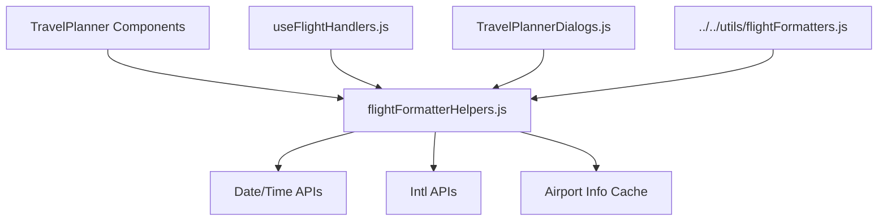

# TravelPlanner Utils 가이드

이 디렉토리는 TravelPlanner에서 사용되는 유틸리티 함수들을 포함합니다. 재사용 가능한 헬퍼 함수들과 데이터 포맷팅 로직을 담당합니다.

## 📁 파일 구조

```
utils/
├── flightFormatterHelpers.js   # 항공편 데이터 포맷팅 헬퍼
└── README.md                    # 이 파일
```

## 🛠️ 각 유틸리티의 역할

### 1. `flightFormatterHelpers.js` (41줄)
**역할**: 항공편 관련 데이터 포맷팅 및 변환

**주요 기능**:
- 항공편 데이터 구조 변환
- 날짜/시간 포맷팅
- 가격 정보 처리
- 공항 코드 변환

**포함된 함수들**:

#### `formatFlightTime(dateTimeString)`
```javascript
// 항공편 시간을 사용자 친화적 형식으로 변환
const formatFlightTime = (dateTimeString) => {
  // "2024-01-15T14:30:00" → "14:30"
  return new Date(dateTimeString).toLocaleTimeString('ko-KR', {
    hour: '2-digit',
    minute: '2-digit'
  });
};
```

#### `formatFlightDuration(duration)`
```javascript
// ISO 8601 duration을 읽기 쉬운 형식으로 변환
const formatFlightDuration = (duration) => {
  // "PT2H30M" → "2시간 30분"
  const match = duration.match(/PT(\d+H)?(\d+M)?/);
  const hours = match[1] ? parseInt(match[1]) : 0;
  const minutes = match[2] ? parseInt(match[2]) : 0;
  return `${hours}시간 ${minutes}분`;
};
```

#### `formatAirportInfo(airportCode, airportInfoCache)`
```javascript
// 공항 코드를 공항 이름으로 변환
const formatAirportInfo = (airportCode, airportInfoCache) => {
  const info = airportInfoCache[airportCode];
  return info ? `${info.name} (${airportCode})` : airportCode;
};
```

#### `calculateLayoverTime(arrival, departure)`
```javascript
// 경유 시간 계산
const calculateLayoverTime = (arrival, departure) => {
  const arrivalTime = new Date(arrival);
  const departureTime = new Date(departure);
  const diffMs = departureTime - arrivalTime;
  const diffHours = Math.floor(diffMs / (1000 * 60 * 60));
  const diffMinutes = Math.floor((diffMs % (1000 * 60 * 60)) / (1000 * 60));
  return `${diffHours}시간 ${diffMinutes}분`;
};
```

**사용 예시**:
```javascript
import { 
  formatFlightTime, 
  formatFlightDuration, 
  formatAirportInfo 
} from '../utils/flightFormatterHelpers';

// 항공편 정보 표시
const FlightInfo = ({ flight, airportCache }) => {
  return (
    <div>
      <p>출발: {formatFlightTime(flight.departure.at)}</p>
      <p>도착: {formatFlightTime(flight.arrival.at)}</p>
      <p>소요시간: {formatFlightDuration(flight.duration)}</p>
      <p>출발공항: {formatAirportInfo(flight.departure.iataCode, airportCache)}</p>
    </div>
  );
};
```

## 🔄 다른 파일들과의 관계



## 💡 사용 패턴

### 1. 컴포넌트에서 직접 사용
```javascript
import { formatFlightTime } from '../utils/flightFormatterHelpers';

const ScheduleItem = ({ schedule }) => {
  return (
    <div>
      {schedule.type === 'flight' && (
        <span>{formatFlightTime(schedule.departureTime)}</span>
      )}
    </div>
  );
};
```

### 2. 훅에서 데이터 전처리
```javascript
// useFlightHandlers.js 내부
import { formatFlightDuration } from '../utils/flightFormatterHelpers';

const processFlightData = (rawFlightData) => {
  return rawFlightData.map(flight => ({
    ...flight,
    formattedDuration: formatFlightDuration(flight.duration)
  }));
};
```

### 3. 다이얼로그에서 상세 정보 표시
```javascript
// TravelPlannerDialogs.js 내부
import { formatAirportInfo } from '../utils/flightFormatterHelpers';

const FlightDetailDialog = ({ flight, airportCache }) => {
  return (
    <Dialog>
      <DialogContent>
        <Typography>
          {formatAirportInfo(flight.origin, airportCache)} → 
          {formatAirportInfo(flight.destination, airportCache)}
        </Typography>
      </DialogContent>
    </Dialog>
  );
};
```

## 🚀 확장 가이드

### 새로운 유틸리티 파일 추가 시:

1. **명확한 목적**: 특정 도메인의 헬퍼 함수들만 포함
2. **순수 함수**: 사이드 이펙트 없는 함수들로 구성
3. **테스트 가능**: 입력과 출력이 명확한 함수들
4. **문서화**: JSDoc 주석으로 함수 설명 추가

### 예시: 새로운 유틸리티 파일 생성
```javascript
// accommodationFormatterHelpers.js
/**
 * 체크인/체크아웃 날짜를 포맷팅
 * @param {string} dateString - ISO 날짜 문자열
 * @returns {string} 포맷된 날짜 문자열
 */
export const formatCheckInDate = (dateString) => {
  return new Date(dateString).toLocaleDateString('ko-KR', {
    month: 'long',
    day: 'numeric'
  });
};

/**
 * 숙박 기간 계산
 * @param {string} checkIn - 체크인 날짜
 * @param {string} checkOut - 체크아웃 날짜
 * @returns {number} 숙박 일수
 */
export const calculateStayDuration = (checkIn, checkOut) => {
  const checkInDate = new Date(checkIn);
  const checkOutDate = new Date(checkOut);
  const diffTime = checkOutDate - checkInDate;
  return Math.ceil(diffTime / (1000 * 60 * 60 * 24));
};
```

### 기존 파일 확장
```javascript
// flightFormatterHelpers.js에 새 함수 추가
/**
 * 항공편 클래스 정보 포맷팅
 * @param {string} cabinClass - 항공편 클래스 코드
 * @returns {string} 한국어 클래스 명
 */
export const formatCabinClass = (cabinClass) => {
  const classMap = {
    'ECONOMY': '이코노미',
    'PREMIUM_ECONOMY': '프리미엄 이코노미',
    'BUSINESS': '비즈니스',
    'FIRST': '퍼스트'
  };
  return classMap[cabinClass] || cabinClass;
};
```

## 📝 코딩 컨벤션

### 1. 함수 명명 규칙
```javascript
// 동사 + 명사 형태
formatFlightTime()     // ✅ 좋음
calculateDuration()    // ✅ 좋음
flightTimeFormat()     // ❌ 나쁨
```

### 2. 에러 처리
```javascript
export const formatFlightTime = (dateTimeString) => {
  try {
    if (!dateTimeString) return '-';
    return new Date(dateTimeString).toLocaleTimeString('ko-KR', {
      hour: '2-digit',
      minute: '2-digit'
    });
  } catch (error) {
    console.warn('Invalid date format:', dateTimeString);
    return '-';
  }
};
```

### 3. 타입 안정성
```javascript
/**
 * @param {string|Date} input - 날짜 입력
 * @returns {string} 포맷된 문자열
 */
export const formatDate = (input) => {
  const date = input instanceof Date ? input : new Date(input);
  if (isNaN(date.getTime())) {
    throw new Error('Invalid date input');
  }
  return date.toLocaleDateString('ko-KR');
};
```

## 🧪 테스트 가이드

### 단위 테스트 예시
```javascript
// flightFormatterHelpers.test.js
import { formatFlightTime, formatFlightDuration } from './flightFormatterHelpers';

describe('flightFormatterHelpers', () => {
  test('formatFlightTime should format time correctly', () => {
    expect(formatFlightTime('2024-01-15T14:30:00')).toBe('14:30');
  });

  test('formatFlightDuration should handle PT2H30M', () => {
    expect(formatFlightDuration('PT2H30M')).toBe('2시간 30분');
  });

  test('should handle invalid input gracefully', () => {
    expect(formatFlightTime(null)).toBe('-');
    expect(formatFlightTime('')).toBe('-');
  });
});
```

## 📚 참고 자료

- [Date 객체 MDN 문서](https://developer.mozilla.org/ko/docs/Web/JavaScript/Reference/Global_Objects/Date)
- [Intl.DateTimeFormat MDN 문서](https://developer.mozilla.org/ko/docs/Web/JavaScript/Reference/Global_Objects/Intl/DateTimeFormat)
- [ISO 8601 Duration 형식](https://en.wikipedia.org/wiki/ISO_8601#Durations)

## 📝 주의사항

- **성능**: 자주 호출되는 함수는 메모이제이션 고려
- **국제화**: 로케일 설정을 매개변수로 받을 수 있도록 설계
- **에러 처리**: 예상치 못한 입력에 대한 방어 코드 작성
- **의존성**: 외부 라이브러리 의존성 최소화
- **문서화**: 복잡한 로직은 주석으로 설명 추가 